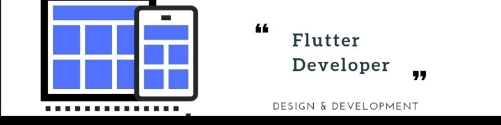

### Hey , I'm Jashwanth Gowda!

<h4>:zap: A Passionate Flutter Developer from India.</h4>

**Talking about Personal Stuffs:**

I am an experienced Flutter software developer with 3 years of industry expertise. I am proficient in building cross-platform applications and delivering user-centric solutions.

- 🔭 I’m currently working on Flutter Based Application!
- 🌱 I’m currently learning Flutter!
- 👯 I’m looking to collaborate with Other Flutter Developers and Flutter Projects.
- 🥅 My 2023-24 Goals: Contribute more to Open Source projects and Work more on Flutter Projects.
- 📫 How to reach me: [Linkedin](https://www.linkedin.com/in/jashwanthgowda-6666) , [Twitter](https://twitter.com/Jash_gowda_6), My email Id: **webdevjash6@gmail.com**
- 📄 Know about my experiences,checkout my [Resume](https://drive.google.com/file/d/1TLp3FMw-O7pjiuBKFw8YqA8aGLrIV692/view?usp=sharing) here.
- ⚡ Hobbies: Cricket, Fitness, Travelling, Coding & Swimming.
- 😄 Pronouns: He/His
<!-- - 💬 Ask me about Opencart or any static website related stuff. -->

 

<h3 align="left">:zap: Languages and Tools:</h3>

                  

<h2>👀 Stats</h2>

 

&nbsp;

 

 

  

<h3>:zap: Recent GitHub Contributions</h3>

 

<!---->

---

 
:zap: Recent GitHub Activity

 <!--RECENT_ACTIVITY:start-->
1. ⭐ Starred [tegonhq/tegon](https://github.com/tegonhq/tegon)
2. ⭐ Starred [darrenburns/posting](https://github.com/darrenburns/posting)
3. 📔 Created new repository [Jashwanth-Gowda-R/my_flutter_widgets](https://github.com/Jashwanth-Gowda-R/my_flutter_widgets)
4. ⭐ Starred [milanm/DevOps-Roadmap](https://github.com/milanm/DevOps-Roadmap)
5. 📔 Created new repository [Jashwanth-Gowda-R/eLearning](https://github.com/Jashwanth-Gowda-R/eLearning)
<!--RECENT_ACTIVITY:end-->

<!--RECENT_ACTIVITY:last_update-->
Last Updated: Saturday, September 28th, 2024, 7:14:02 AM
<!--RECENT_ACTIVITY:last_update_end-->

 

<h3 align="center">:zap: Connect With Me:</h3>

